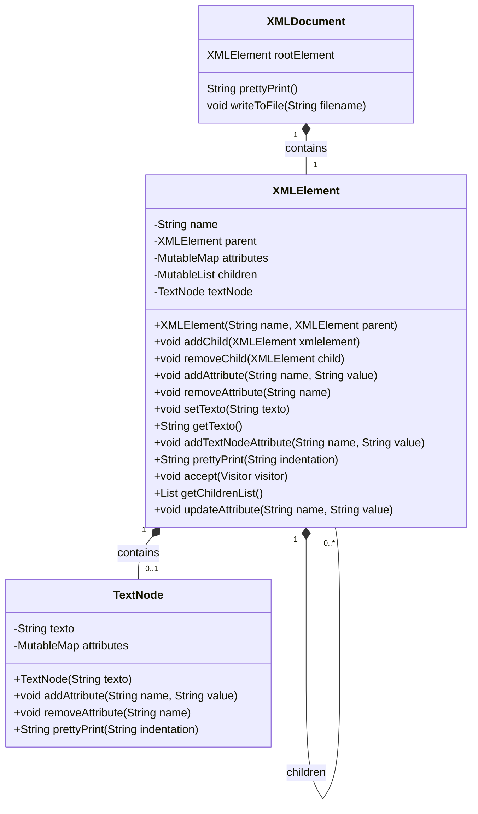

# Biblioteca de Manipulacão de Ficheiros XML 

Na sequência da unidade curricular __Programação Avançada__ foi nos proposto pelo professor André Santos a construção de uma biblioteca em __Kotlin__ para realizar a manipulação de ficheiros __XML__ desta forma surgiu a __XMLlib__.

A Biblioteca __XMLlib__ é uma ferramenta para manipulação de documentos XML em projetos Kotlin que oferece uma variedade de funcionalidades para criar, modificar e manipular elementos XML de forma eficiente.

## Visão Geral 
A Biblioteca __XMLlib__ simplifica a manipulação de documentos XML em projetos Kotlin, oferecendo uma API fácil de usar e poderosa. Com esta biblioteca, os desenvolvedores podem criar documentos XML, adicionar elementos e atributos, escrever em arquivos e muito mais.

A biblioteca XML foi projetada em torno de três principais classes: XMLDocument, XMLElement e TextNode. Cada uma destas classes desempenha um papel específico na representação e manipulação do documento XML.

__XMLDocument__
A classe XMLDocument é a entrada principal da biblioteca e representa um documento XML completo. Ela contém o elemento raiz (rootElement), que é uma instância da classe XMLElement. Além de fornecer métodos para a impressão formatada do documento (prettyPrint) e para a escrita do conteúdo XML em um arquivo (writeToFile), a classe XMLDocument serve como ponto de partida para construir e manipular a estrutura do documento XML.

__XMLElement__
A classe XMLElement representa um elemento individual dentro do documento XML. Cada XMLElement possui um nome, um possível elemento pai, atributos, filhos e um possível nó de texto. Esta classe oferece uma variedade de métodos para:

Gerir Atributos: Adicionar, remover e atualizar atributos associados ao elemento.
Manipular Filhos: Adicionar e remover elementos filhos, permitindo a construção de uma árvore de elementos XML.
Trabalhar com Texto: Definir e obter o texto associado ao elemento.
Impressão Formatada: Gerar uma representação formatada do elemento e seus filhos.

__TextNode__
A classe TextNode é utilizada para representar o texto contido dentro de um XMLElement. Além de armazenar o texto, um TextNode pode ter seus próprios atributos. Esta classe fornece métodos para adicionar e remover atributos do nó de texto e para gerar uma representação formatada do texto.

## Diagrama de Classes


## Principais Funcionalidades 

1. [Adicionar e Remover Entidades](#adicionar-e-remover-entidades)
2. [Adicionar, Remover e Alterar Atributos em Entidades](#adicionar-remover-e-alterar-atributos-em-entidades)
3. [Aceder à Entidade Mãe e Entidades Filhas de uma Entidade](#aceder-à-entidade-mãe-e-entidades-filhas-de-uma-entidade)
4. [Pretty Print em Formato de String e Escrita para Ficheiro](#pretty-print-em-formato-de-string-e-escrita-para-ficheiro)
5. [Varrimento do Documento com Objetos Visitantes (Visitor)](#varrimento-do-documento-com-objetos-visitantes-visitor)
6. [Adicionar Atributos Globalmente ao Documento](#adicionar-atributos-globalmente-ao-documento)
7. [Renomeação de Entidades Globalmente ao Documento](#renomeação-de-entidades-globalmente-ao-documento)
8. [Renomeação de Atributos Globalmente ao Documento](#renomeação-de-atributos-globalmente-ao-documento)
9. [Remoção de Entidades Globalmente ao Documento](#remoção-de-entidades-globalmente-ao-documento)
10. [Remoção de Atributos Globalmente ao Documento](#remoção-de-atributos-globalmente-ao-documento)

#### Exemplos do Uso das Principais Funcionalidades 

##### Adicionar e Remover Entidades

Para __adicionar__ uma entidade ao documento XML, use o método __addChild__.

```kotlin
val rootElement = XMLElement("root")
val childElement = XMLElement("child")
rootElement.addChild(childElement)
```

Para __remover__ uma entidade, use o método __removeChild__.

```kotlin
rootElement.removeChild(childElement)
```
##### Adicionar, Remover e Alterar Atributos em Entidades

Para __adicionar__ Para adicionar um atributo a uma entidade, use o método __addAttribute__.

```kotlin
val element = XMLElement("element")
element.addAttribute("attr1", "value1")
element.addAttribute("attr2", "value2")
```

Para __remover__ um atributo, use o método __removeAttribute__.

```kotlin
element.removeAttribute("attr1")
```

Para __alterar__ um atributo, use o método __updateAttribute__.

```kotlin
elemt.addAttribute("version","1.0")
element.updateAttribute("version", "2.0")
```

##### Aceder à Entidade Mãe e Entidades Filhas de uma Entidade

Para __aceder__ à entidade mãe, utilize a propriedade __parent__.

```kotlin
val parentElement = childElement.parent
```

Para __aceder__ às entidades filhas, utilize a método __getChildrenList__.

```kotlin
val children = parentElement.getChildrenList()
```

##### Pretty Print em Formato de String e Escrita para Ficheiro

Para obter a representação bonita (__pretty print__) de uma entidade como uma string, use o método __prettyPrint__.

```kotlin
val prettyXml = rootElement.prettyPrint()
println(prettyXml)
```
Para __escrever a estrutura XML para um ficheiro__, use o método __writeToFile__.

```kotlin
xmlDocument.writeToFile("output.xml")
```
##### Varrimento do Documento com Objetos Visitantes (Visitor)

Para __implementar um padrão Visitor__, __crie__ um objeto __Visitor__ e aplique-o ao documento.

```kotlin
interface Visitor {
    fun visit(element: XMLElement)
}

class PrintVisitor : Visitor {
    override fun visit(element: XMLElement) {
        println(element.name)
    }
}

val visitor = PrintVisitor()
rootElement.accept(visitor)
```
##### Adicionar Atributos Globalmente ao Documento

Para __adicionar atributos globalmente__ a todas as entidades com um determinado nome:

```kotlin
xmlDocument.addGlobalAttribute("entityName", "attributeName", "attributeValue")
```
##### Renomeação de Entidades Globalmente ao Documento

Para __renomear todas as entidades__ com um determinado nome:

```kotlin
xmlDocument.renameGlobalEntity("oldName", "newName")
```
##### Renomeação de Atributos Globalmente ao Documento

Para __renomear atributos globalmente__ para todas as entidades com um determinado nome:

```kotlin
xmlDocument.renameGlobalAttribute("entityName", "oldAttributeName", "newAttributeName")
```
##### Remoção de Entidades Globalmente ao Documento

Para __remover todas as entidades__ com um determinado nome:

```kotlin
xmlDocument.removeGlobalEntity("entityName")
```
##### Remoção de Atributos Globalmente ao Documento

Para __remover atributos globalmente para todas as entidades__ com um determinado nome:

```kotlin
xmlDocument.removeGlobalAttribute("entityName", "attributeName")
```

## Conclusão 

Este documento apresentou as principais funcionalidades da biblioteca XMLlibDocument. Para mais informações, consulte a documentação do código-fonte e os casos de teste fornecidos no repositório GitHub.

## Créditos 
Esta biblioteca foi desenvolvida por Diogo Lopes e Gonçalo Lopes.